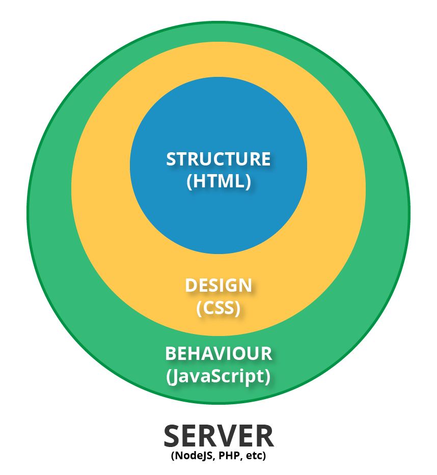
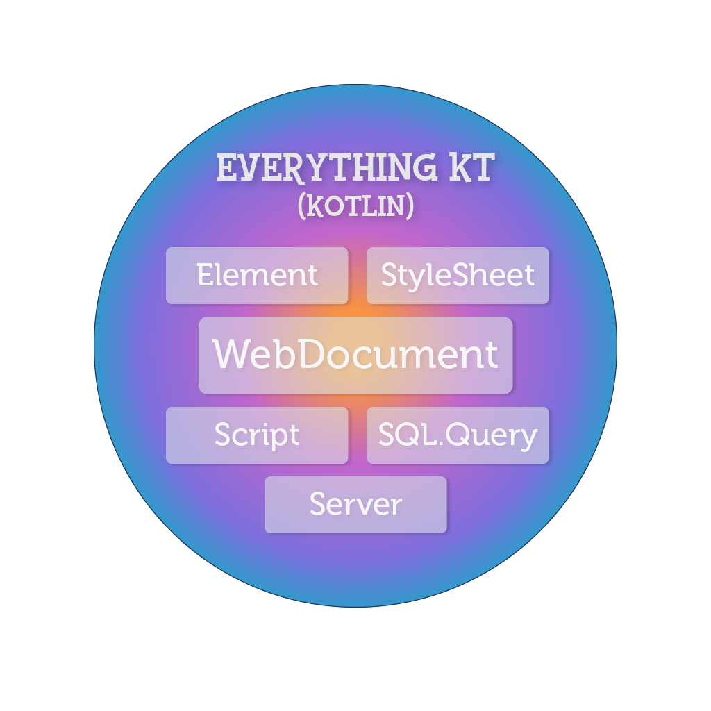
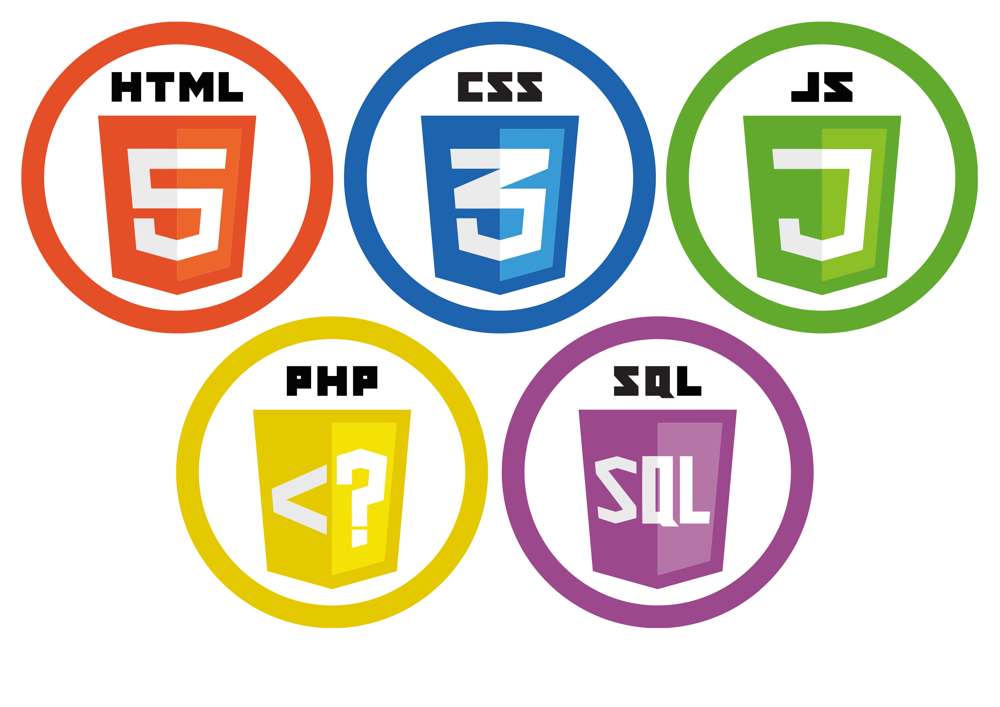
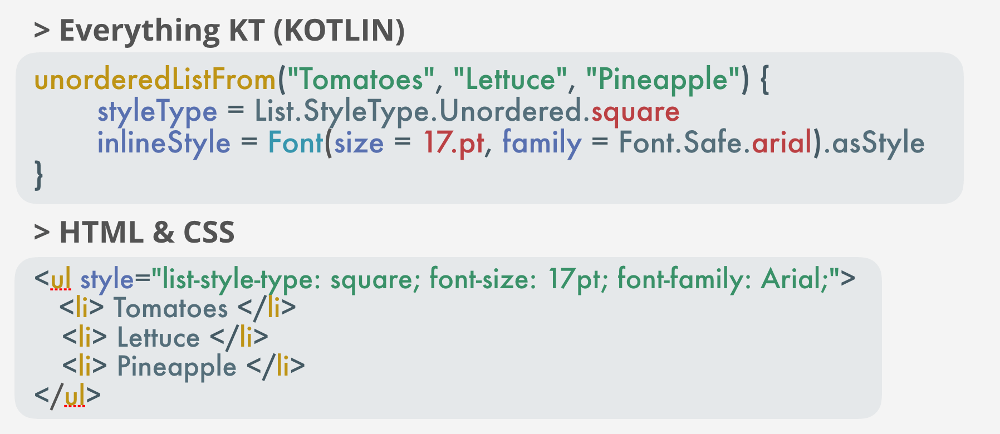

# EverythingKT

[](https://github.com/illescasDaniel/EverythingKT/releases)
[](https://github.com/illescasDaniel/EverythingKT/blob/master/LICENSE)
[](https://kotlinlang.org)

EKT is a Kotlin library which helps **developing Websites in a more simple, clear and faster way**. It's aimed to developers with previous programming knowledge that pretend to avoid most syntactic errors and want an easy way of deploying the websites.

One of the main goals is not to use multiple languages directly (HTML, CSS, JS, SQL...), but instead using one which you can use to represent everything (paragraphs, links, styles, etc) in a way that it will **automatically translate from Kotlin to all the other languages** with the **proper code verifications** to minimise the errors. It also allows the developers to **share some code with Android apps** (made in Kotlin).

  

## Table of contents

*   [Key points](https://github.com/illescasDaniel/EverythingKT#key-points)
*   [Motivation](https://github.com/illescasDaniel/EverythingKT#motivation)
*   [Current status](https://github.com/illescasDaniel/EverythingKT#current-status)
*   [Code examples](https://github.com/illescasDaniel/EverythingKT#code-examples)
    *   [Starting the NodeJS integrated Web Server](https://github.com/illescasDaniel/EverythingKT#starting-the-nodejs-integrated-web-server)
    *   [Creating your first WebDocument](https://github.com/illescasDaniel/EverythingKT#creating-your-first-webdocument)
    *   [Using JavaScript in Kotlin](https://github.com/illescasDaniel/EverythingKT#using-javascript-in-kotlin)
*   [Installation](https://github.com/illescasDaniel/EverythingKT#installation)
*   [License](https://github.com/illescasDaniel/EverythingKT#license)

### Key points

*   Make website with just **one language**, Kotlin.
*   Avoid most syntax errors with **compilation time checking**.
*   **Share some code with** other platforms like **Android**.

### Motivation

In an Web developers world where you have to use up to 5 different languages, all interpreted, on the same Website, it is sometimes quite difficult to maintain code like that or to interact between all of them.

 

I'd love to see another unified, non-interpreted, highly advanced language to completely replace the Web; but that's something out of my hand, so I decided to create a library to create your websites with the advantages I just mentioned and without the hassels of the standard development.

### Current Status

This is a base version for what I have planned for EKT, but anyone can create whatever they want with the current status of the library. Further development will mean:

*   More polished code.
*   Futher support for SQL.
*   Better interaction with Android apps/code.
*   MVC patterns.
*   CSS or JS frameworks made in Kotlin (some adaptation of Boostrap or jQuery for example).

### Code examples

 

#### Starting the NodeJS integrated Web Server

```kotlin
val server = Server(port = 3000, listenHandler = { portNumber ->
    println("Listening on port: $portNumber")
}, routeGetHandler = { _, response ->
    val web = IndexWeb()
    web.html.writeOutputToPageFolder()
    response.sendFile(".../EverythingKT/public")
})
```

This opens a connection to deliver a Web page through the port 3000.

The code made in the IndexWeb class is automatically transformed to HTML, CSS, JS…, you then can write its output to a folder and deliver the whole folder as you see above.

#### Creating your first WebDocument

```kotlin
package WebExample

import Everything.Row
import Everything.WebDocument.WebDocument

class IndexWeb(rows: ArrayList<Row>): WebDocument() {
   override val styleSheet = IndexStyleSheet.value
   override val document = IndexHTML(rows).value
   override val dbContent = IndexDB.value
}
```

The idea here is to create separte files for the corresponding HTML, CSS, JS, SQL.

In this case we decided to pass an array of rows extracted from a DB (see how we do this on the example Main.kt) which information is obtained from the `dbContent` property, which is a class. The web document also gets its html code from a class that we created, named IndexHTML, which returns an HTML object.

Most of those properties will provide its content like this:

```kotlin
class IndexHTML {
    val value: HTML by lazy {
    ...
    }
}
// or:
class IndexStyleSheet {
    companion object {
        val value = StyleSheet(
        ...
        )
    }
}
```

#### Using JavaScript in Kotlin

For JavaScript, internally is a bit more complicated. We have a Kotlin2JavaScript folder in with you have to create a symbolic link of HeadScripts.kt, StartScripts.kt and EndScript.kt to your website folder (src/main/kotlin/**MyWeb**).

The JavaScript output of those kotlin files, which are compiled separetedly from you website, will be later copied to the public folder in which all the Web output is stored.

An example of a script:

```kotlin
import org.w3c.dom.HTMLInputElement
import kotlin.browser.document
import kotlin.browser.window
import Everything.Common.*

class EndScripts {
  companion object {
    private val paypalScript = {
      val paypalModalSection = document.elementWith(id = IndexWebID.paypal)
        ...
    }
    // more scripts...
  }
}
```

All scripts share a common file, which should be place in: **Kotlin2JavaScript/source/CommonSources**. In this file you can write code using the Common library classes, functions… that you can also use in a normal file, like the IDs or css clases:

```Kotlin
import Everything.Common.*

enum class IndexWebClass: CSSClass {
    sectionsWidth, paypalButton, inputPayPal, ...
}

enum class IndexWebID: CSSID {
    mainSection, paypal, showPayPalOptions, ...
}
```

This enables you to use your css classes names (which by the way are compile time checked 😉) between the above "javascript" (in kotlin) files and the rest of your website (you could use these IDs on an html element for example).

### Installation

Pre-requisited:

*   Gradle.
*   NodeJS.
*   npm (A NodeJS package manager), EKT requires the **express** and **mysql** packages at the moment.

Setup:

*   Download the basic kotlin-node project example from [here](https://github.com/miquelbeltran/kotlin-node.js) (thx to [@miquelbeltran](https://github.com/miquelbeltran/kotlin-node.js/commits?author=miquelbeltran)).
*   You'll need now the whole EKT library, which will be place in `src/main/kotlin/`, and also the `Kotlin2JavaScript` folder and its contents.

### License

The project license is **MPL**, which basically states (more info [here](https://choosealicense.com/licenses/mpl-2.0/#)) that you can get this code, distribute it, modify it… but if you make a work using this library you **must**:

*   Include the license and copyright notice.
*   Disclose the **source code files of this library** that you use in your project (not the whole project…) when the software is distributed.
*   Release your software (~just the modified libraries of EVK) under the same license or under a compatible one (see full MPL license for more details).